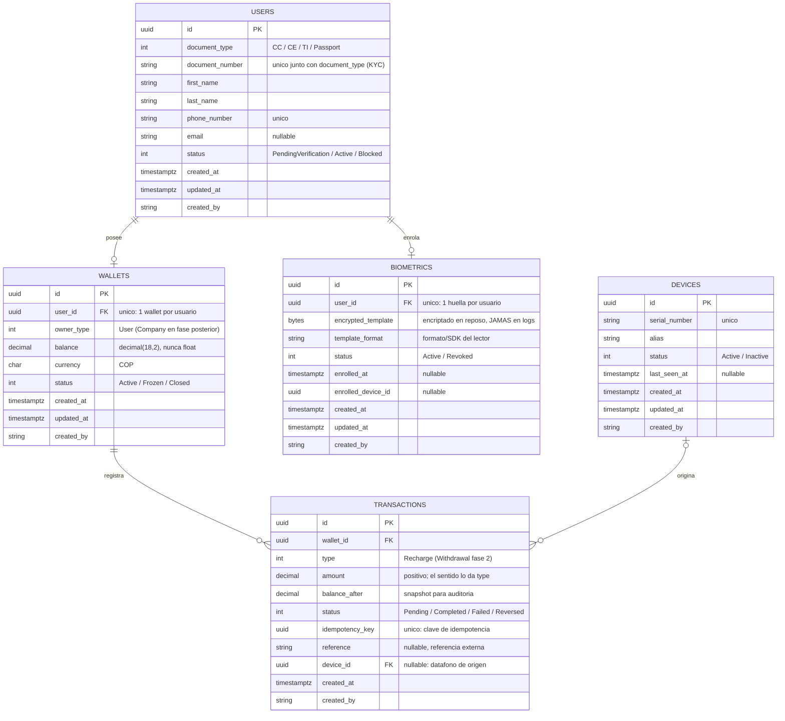

# TUGU — Diagrama ER (MVP)

Modelo de datos del MVP. Cinco entidades; `companies` y `reports` quedan
deliberadamente fuera hasta que se pidan.

Convenciones: UUID como PK en todo, timestamps en UTC, montos siempre
`decimal`, auditoría (`created_at`, `updated_at`, `created_by`) en todas
las entidades.

## Notas de diseño

- **Pago solo con huella (identificación 1:N):** el datáfono captura la huella
  y el backend identifica al usuario contra los templates enrolados. No hay QR
  ni búsqueda por documento en el flujo de pago. El documento existe solo como
  dato de identidad (KYC).
- **Sin `password_hash`:** las credenciales de login vivirán en Amazon Cognito
  (Tarea 1.4). Guardarlas también en nuestra BD duplicaría autenticación.
- **`transactions` es inmutable:** los errores se corrigen con transacciones de
  reversa, nunca editando la original. `balance_after` guarda el saldo
  resultante como evidencia de auditoría.
- **Idempotencia:** `idempotency_key` tendrá índice único; un reintento con la
  misma clave devuelve la transacción original en vez de duplicar el efecto.
